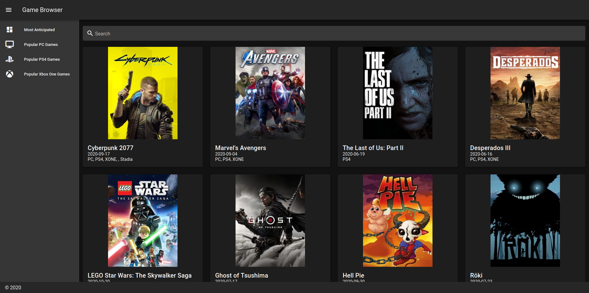
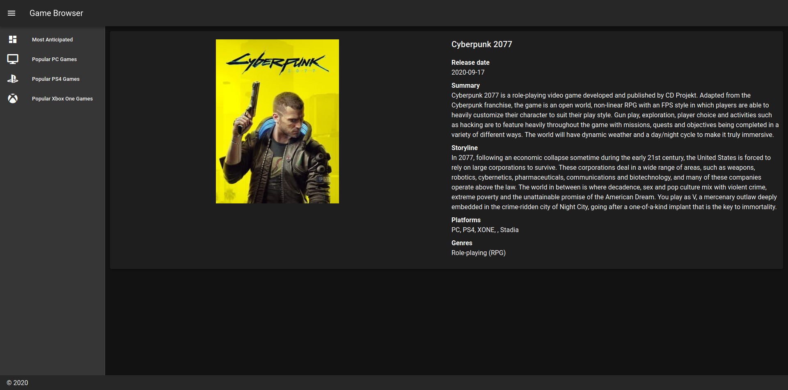

## About

Laravel application built with Inertia.js and Vue.js. 

## Usage
* ``` cp .example.env .env```
* ``` php artisan key:generate```
* Add Twitch ```CLIENT_ID```  and ```CLIENT_SECRET``` to .env

## Screenshots


